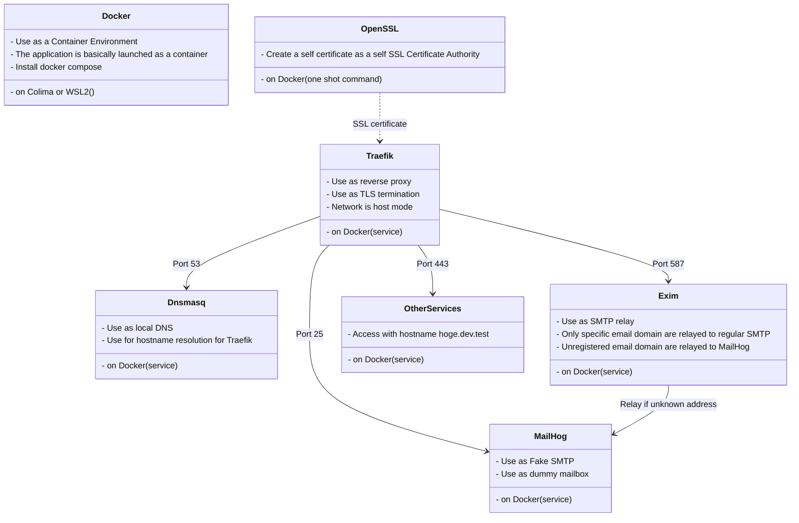

# DevBase

Development base environment stack using Docker containers. Using Traefik with TLS, Dnsmasq, Exim4 and MailHog.

I have confirmed that it works with Colima on macOS (and sometime WSL2 on Windows 10).
It will probably work on Linux as well.

**日本語の説明/Japanease description**

- [紹介記事](https://zenn.dev/arkbig/articles/devbase_b8b43191f863f8024a83f824c832f8ca0e5d209254)に日本語で使用方法を書いています。
- [実装の解説本](https://zenn.dev/arkbig/books/devbase-2022_b1b24e6e8db350a1f7f379af3833e90d79ad5
)に日本語で実装について書いています。

## Key Features

- The combination of Traefik and Dnsmasq allows switching the access container by hostname instead of port number.
- You can use MailHog to receive even dummy email addresses.
- By using Exim4, only specific domains can be forwarded to regular SMTP.
- Create a self certification authority and a self certificate with openssl to enable https access.

## The software used



## Motivation

- Want to have the same environment locally as in production.
  - Use hostname instead of ip address and port number.
  - Use https instead of http.
- Want to receive notification locally as well.

## Install

1. Clone this repository and copy sample.env to .env. (Run on WSL2 if Windows)

   ```sh
   git clone https://github.com/arkbig/devbase.git
   cd devbase
   cp sample.env .env
   ```

2. Edit .env.

   - <details><summary>▸🍎 for Mac (click here to expand)</summary>

     1. CONTAINER_UID / CONTAINER_GID

        ```sh
        sed -i "" "s/^CONTAINER_UID=.*/CONTAINER_UID=$(id -u)/" .env
        sed -i "" "s/^CONTAINER_GID=.*/CONTAINER_GID=$(id -g)/" .env
        ```

     2. DNSMASQ_ADDR / DNSMASQ_SERVER

        ```sh
        # Change to your ethernet.
        use_eth=en0
        sed -i "" "s/^DNSMASQ_ADDR=.*/DNSMASQ_ADDR=`ifconfig "${use_eth}" |grep 'inet '|awk 'END {print $2}'`/" .env
        # DNSMASQ_SERVER is set up but unused on Mac.
        sed -i "" -r "s/^#? ?DNSMASQ_SERVER=.*/DNSMASQ_SERVER=`cat /etc/resolv.conf|grep '^nameserver '|awk 'NR==1 {print $2}'`/" .env
        ```

     3. EXIM4_RELAY_DOMAIN / EXIM4_RELAY_ADDR
        This is used to forward mail received by Exim4 to `EXIM4_RELAY_ADDR` if the recipient is `EXIM4_RELAY_DOMAIN`.
        set if you want.
        It is also possible to specify multiple composites with sequential numbers such as \*\_1,\*\_2 in compose.override.yaml.

     4. COMPOSE_PROFILES
        If your environment does not support UDP tunneling (like Colima), enable udptunnel.

     </details>

   - <details><summary>▸🪟 for Windows(WSL2) (click here to expand)</summary>

     1. CONTAINER_UID / CONTAINER_GID

        ```sh
        sed -i "s/^CONTAINER_UID=.*/CONTAINER_UID=$(id -u)/" .env
        sed -i "s/^CONTAINER_GID=.*/CONTAINER_GID=$(id -g)/" .env
        ```

     2. DNSMASQ_ADDR / DNSMASQ_SERVER
        DNSMASQ_ADDR is the fixed IP address to be given to WSL2 after this, but if you do not change it, the default `192.168.100.100` is ok.
        I could not find a good one-liner to rewrite DNSMASQ_SERVER, so I will set it manually.Check the DNS server from the adapter you use in Windows "Network Connections".
        It is usually the same as the Default Gateway shown by "ipconfig" at the command prompt.

     3. EXIM4_RELAY_DOMAIN / EXIM4_RELAY_ADDR
        This is used to forward mail received by Exim4 to `EXIM4_RELAY_ADDR` if the recipient is `EXIM4_RELAY_DOMAIN`.
        set if you want.
        It is also possible to specify multiple composites with sequential numbers such as \*\_1,\*\_2 in compose.override.yaml.

     </details>

   - <details><summary>▸🐧 for Ubuntu (click here to expand)</summary>

     1. CONTAINER_UID / CONTAINER_GID

        ```sh
        sed -i "s/^CONTAINER_UID=.*/CONTAINER_UID=$(id -u)/" .env
        sed -i "s/^CONTAINER_GID=.*/CONTAINER_GID=$(id -g)/" .env
        ```

     2. DNSMASQ_ADDR / DNSMASQ_SERVER

        ```sh
        # Change to your ethernet.
        use_eth=eth0
        sed -i "s/^DNSMASQ_ADDR=.*/DNSMASQ_ADDR=`ip a show ${use_eth}|grep 'inet '|awk 'END {print $2}'|awk -F '/' '{print $1}'`/" .env
        # or set manually.
        sed -i "" -r "s/^#? ?DNSMASQ_SERVER=.*/DNSMASQ_SERVER=`cat /etc/resolv.conf|grep '^nameserver '|awk 'END {print $2}'`/" .env
        ```

     3. EXIM4_RELAY_DOMAIN / EXIM4_RELAY_ADDR
        This is used to forward mail received by Exim4 to `EXIM4_RELAY_ADDR` if the recipient is `EXIM4_RELAY_DOMAIN`.
        set if you want.
        It is also possible to specify multiple composites with sequential numbers such as \*\_1,\*\_2 in compose.override.yaml.

     </details>

3. Make certificates first.

   ```sh
   mkdir sslcert/.certs
   docker compose build sslcert
   docker compose run --rm sslcert
   # Stop with Ctrl-C
   ```

4. Register sslcert/.certs/ca-My-Test.cer to the OS

   - <details><summary>▸🍎 for Mac (click here to expand)</summary>

     - To Keychain Access. (Open the .cer file in the finder.)

     </details>

   - <details><summary>▸🪟 for Windows(WSL2) (click here to expand)</summary>

     - To MMC. (Open the .cer file in the explorer.)
       - Certificate store is "Trusted Root Certification Authorities".
     - Also installed in WSL2 (see Ubuntu)

     </details>

   - <details><summary>▸🐧 for Ubuntu (click here to expand)</summary>

     - Copy & Add

       ```sh
       sudo mkdir /usr/share/ca-certificates/self
       sudo cp ./sslcert/.certs/ca-My-Test.cer /usr/share/ca-certificates/self/
       sudo echo "self/ca-My-Test.cer" >> /etc/ca-certificates.conf
       sudo update-ca-certificates
       ```

     </details>

5. Run compose.

   ```sh
   docker compose up -d
   ```

   - Although an image is specified, it does not exist, so a pull will result in an error and build will run.

6. DNS related settings

   - <details><summary>▸🍎 for Mac (click here to expand)</summary>

     - ❓ Check command is `sudo lsof -i:53`. If TCP is present but UDP is not, as shown below, this is not supported UDP port forwarding.

       ```sh
       COMMAND   PID USER   FD   TYPE             DEVICE SIZE/OFF NODE NAME
       ssh       732  big   41u  IPv4 0xbeaf      0t0  TCP *:domain (LISTEN)
       🆖 UDP is missing. So run udptunnel.
       ```

     - Run udptunnel using socat. If UDP was supported, skip this next is add to resolver.

       - for host

         ```sh
         sudo brew install socat
         udptunnel/forward_udp.sh udptunnel/udp_forwarding.conf &
         # If you want to stop, run the following command
         # udptunnel/forward_udp.sh udptunnel/udp_forwarding.conf kill
         ```

       - for container

         ```sh
         COMPOSE_PROFILES=udptunnel docker compose up -d --build
         ```

         Also, you can add `COMPOSE_PROFILES=udptunnel` to `.env`

     - Add to resolver for dnsmasq

       ```sh
       sudo mkdir /etc/resolver
       # "test" is the domain name to be used.
       vi /etc/resolver/test
       ```

       - `/etc/resolver/test` contents.

         ```ini
         options timeout:1
         options attempts:2
         options use-vc
         nameserver 127.0.0.1
         ```

     </details>

   - <details><summary>▸🪟 for Windows(WSL2) (click here to expand)</summary>

     1. Set and run wsl2/wsl_startup.bat as administrator on host Windows.
        If necessary, copy wsl_env.bat to .wsl_env.bat to set variables.
        wsl_startup.bat does the following by default:

        - Set static ip address to WSL. (IMPORTANT here)
        - Start dockerd
        - Start sshd
        - Port forwarding for ssh

        Register wsl_startup_helper.bat in task scheduler to run as administrator at startup.
        Copy these like `cp wsl2/wsl_startup_helper.bat to /mnt/c/Users/$USER/` first.
        And wsl_startup_helper.bat's arg is path to wsl_startup.bat like `\\wsl$\Ubuntu-20.04\Home\user\devbase\wsl2\wsl_startup.bat`

     2. ❓ Check command is `ping 192.168.100.100`.(This is the DNSMASQ_ADDR.) Both Win and WSL.
     3. Change adapter settings.
        Set "Use the following DNS server addresses:"

        - Preferred DNS server: 192.168.100.100 (This is the DNSMASQ_ADDR.)
        - Alternate DNS server: 1.1.1.1 (This is your real DNS.)

     4. For WSL2(in WSL2)

        create `/etc/wsl.conf` (sudo vi /etc/wsl.conf)

        ```ini
        [network]
        generateResolvConf = false
        ```

        ```sh
        sudo cp /etc/resolv.conf /etc/resolv.conf.bak
        sudo rm /etc/resolv.conf
        sudo mv /etc/resolv.conf.bak /etc/resolv.conf
        vi /etc/resolv.conf
        ```

        ```ini
        options timeout:1
        options attempts:2
        nameserver 127.0.0.1
        # This is your real DNS ($DNSMASQ_SERVER in .env)
        nameserver 1.1.1.1
        ```

     </details>

   - <details><summary>▸🐧 for Ubuntu (click here to expand)</summary>

     - Add to /etc/resolv.conf

       ```ini
       options timeout:1
       options attempts:2
       nameserver 127.0.0.1
       # This is your real DNS ($DNSMASQ_SERVER in .env)
       nameserver 1.1.1.1
       ```

     </details>

7. ❓ Check.
   - Access <https://traefik.dev.test>
   - If you see the Traefik dashboard, success!🎉

## Usage

- **Traefik**: [https://traefik.dev.test]
  - Traefik is reverse-proxy.
  - Registered domains can be viewed on the dashboard.
- **MailHog**: [https://mailhog-devbase.dev.test]
  - MailHog is dummy mail box.
  - You can see the emails sent to `mailhog-devbase.dev.test:25` or `exim4-devbase.dev.test:587`.

If you want to add other services, maybe you can create a branch.

```sh
git checkout -b local
```

Then add it to compose.yaml. For example, if you want to add plantuml.

```yml
  plantuml:
    image: plantuml/plantuml-server
    restart: unless-stopped
    ports:
      - 127.0.0.1::8080
    labels:
      - traefik.enable=true
      - traefik.http.routers.plantuml-${COMPOSE_PROJECT_NAME:-devbase}.entrypoints=https
```

Once applied with `docker compose up -d`, PlantUML can be used at [https://plantuml-devbase.dev.test].

## Notes

The self certificate is set to expire in 60 days; it is automatically renewed if the sslcert service is started, but the dynamic detection of the file does not work well on Colima and Traefik needs to be started again.

This will be automatically restarted and updated when the PC is started, as long as the PC is shut down daily.

Or

```sh
docker compose restart
```

## License

This repository's license is [zlib](./LICENSE). Please feel free to use this, but no warranty.

Also using the following OSS:

| Software                                              | License                 |
| ----------------------------------------------------- | ----------------------- |
| [Dnsmasq](https://thekelleys.org.uk/dnsmasq/doc.html) | License: GPL, version 3 |
| [Exim](https://www.exim.org)                          | License: GPL, version 3 |
| [MailHog](https://github.com/mailhog/MailHog)         | License: MIT            |
| [OpenSSL](https://www.openssl.org)                    | License: OpenSSL        |
| [Socat](http://www.dest-unreach.org/socat/)           | License: GPL, version 2 |
| [Traefik](https://github.com/traefik/traefik)         | License: MIT            |
