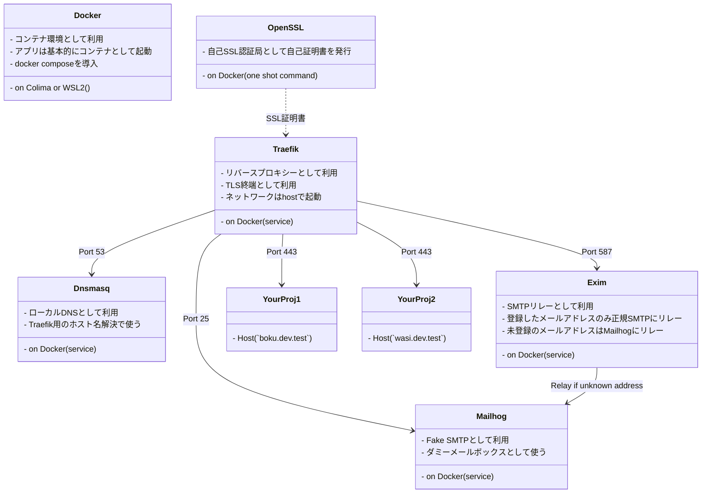

# devbase

Development base environment using Docker containers. Using Traefik with TLS, Dnsmasq, Exim4 and Mailhog.

devbaseはDockerコンテナを利用した開発環境の基本セットです。

The software used is as follows



## Install方法

1. clone this repositoy.

    ```sh
    git clone https://github.com/arkbig/devbase.git
    cd devbase
    ```

2. create certificates.

    ```sh
    docker compose build sslcert
    mkdir sslcert/.certs
    docker compose run --rm sslcert
    ```

3. run compose.

    ```sh
    docker compose up -d
    ```

4. If udp port forwarding is not available, run udptunnel in the background.
   - 🍎 for Mac.
     - ❓ Check command is `sudo lsof -i:53`. If TCP is present but UDP is not, as shown below, this is not supported.

        ```sh
        COMMAND   PID USER   FD   TYPE             DEVICE SIZE/OFF NODE NAME
        ssh       732  big   41u  IPv4 0xbeaf      0t0  TCP *:domain (LISTEN)
        🆖 UDP is missing. So run udptunnel.
        ```

     - Run udptunnel using socat

        ```sh
        sudo brew install socat
        udptunnel/forward_udp.sh udptunnel/udp_forwarding.conf &
        # If you want to stop, run the following command
        # udptunnel/forward_udp.sh udptunnel/udp_forwarding.conf kill
        ```

     - Run udptunnel service on container
       - Also, you can add `COMPOSE_PROFILES=udptunnel` to `.env`

        ```sh
        COMPOSE_PROFILES=udptunnel docker compose up -d
        ```

5. Register to the OS DNS.
   - 🍎 for Mac.

        ```sh
        sudo mkdir /etc/resolver
        # "test" is the domain name to be used.
        vi /etc/resolver/test
        ```

     - `/etc/resolver/test` contents.

        ```ini
        options timeout:1
        options attempts:2
        options use-vc
        nameserver 127.0.0.1
        ```

6. ❓ Check.
   - Access <https://traefik.dev.test>
   - If you see the Traefik dashboard, success!🎉

## Customize

### Popular settings

`compose.override.yaml`にDNSMASQ_ADDRを設定します。
IPアドレスの部分は自分のマシンのものに置き換えてください。
127.0.0.1だとコンテナから*.dev.testにアクセスした場合、コンテナ内を指すことになります。
このようにホストのIPアドレスを指定すれば、コンテナからもホストマシンへアクセスできるようになります。

```yaml
services:
  dnsmasq:
    environment:
      DNSMASQ_ADDR: 10.0.0.101
```

### Self CA / Self signed certificates

compose.override.yamlのsslcertサービスにenvironmentsを指定すると変更できます。
下記がデフォルト値での設定例です。

```yaml
  sslcert:
    environment:
      # 作成される証明書たちのownerを指定
      CONTAINER_UID: 501
      CONTAINER_GID: 20
      # 出力先フォルダ(コンテナ内パス)
      CERTS_OUT: /certs
      # 自己認証局の設定
      ## 名称
      CA_CN: My Test
      ## 生成するファイルのbasename
      CA_FILEBODY: <normalized CA_CN>
      ## OSに登録する認証局の証明書ファイル名
      CA_CERT: $CA_FILEBODY.cer
      ## 証明書発行時に使用する証明書の秘密鍵
      CA_KEY: $CA_FILEBODY.key
      ## 秘密鍵の保存時の暗号パスワード（空文字なら平文保存）
      CA_PASS: $CA_FILEBODY.pass
      ## 認証局の属性
      ## /C=国コード/ST=県/O=組織名/OU=部門などが指定できる
      ## /CN=が未指定なら自動で/CN=$CA_CNが付与される
      CA_SUBJ: /CN=$CA_CN
      # 自己証明書の設定
      ## 名称（古いシステム用のドメイン）
      SSL_CN: dev.test
      ## 新しいシステム用のSANなど
      SSL_ADDEXT: subjectAltName=DNS:test,DNS,dev.test,DNS:*.dev.test,DNS:localhost,DNS:dev.localhost,DNS:*.dev.localhost,IP:127.0.0.1
      ## 生成するファイルのbasename
      SSL_FILEBODY: <normalized SSL_CN>
      ## サーバーに設定する自己証明書（公開鍵）
      SSL_CERT: $SSL_FILEBODY.cer
      ## サーバーに設定する自己証明書の秘密鍵
      SSL_KEY: $SSL_FILEBODY.key
      ## 認証局への署名リクエストファイル（手抜きなので本番には使えない）
      SSL_CSR: $SSL_FILEBODY.csr
      ## 自己証明書の保存時の暗号パスワード（空文字なら平文保存）
      SSL_PASS: ""
      ## 自己証明書のシリアル番号保存ファイル
      SSL_SERIAL: $SSL_FILEBODY.srl
      ## 自己証明書の属性
      ## /C=国コード/ST=県/O=組織名/OU=部門などが指定できる
      ## /CN=が未指定なら自動で/CN=$SSL_CNが付与される
      SSL_SUBL: /CN=$SSL_CN
```

### Dnsmasq

compose.override.yamlのdnsmasqサービスにenvironmentを指定すると変更できます。
下記がデフォルト値での設定例です。

通常は`DNSMASQ_ADDR`を指定します。
固定IPならホストマシンのIPアドレス、そうでなければループバックインターフェイスを作成してそれを指定することになるでしょう。

DNSMASQ_DOMAINに指定した値によって、OSのresolverに登録するドメインも変わります。
DNSMASQ_{DOMAIN,ADDR}_1とか追加で指定したときも、OSのresolverに追加登録が必要です。

```yaml
  dnsmasq:
    environment:
      # Dnsmasqの起動引数
      # この他に -A "/$DNSMASQ_DOMAIN/DNSMASK_ADDR -A ...が付与される
      DNSMASQ_ARGS: -b -D -h -k -n -R -u root -8 -
      # メインの変換ドメイン
      DNSMASQ_DOMAIN: .test
      # メインの変換IPアドレス(コンテナから使用するため、ホストIPアドレスにすべき)
      DNSMASQ_ADDR: 127.0.0.1
      # 追加の変換ドメイン
      DNSMASQ_DOMAIN_1:
      # 追加の変換IPアドレス
      DNSMASQ_ADDR_1:
      # 以降も連番で指定可能
      # 空文字れつもしくは未定義に遭遇するとそこで終了
      # "-"ハイフンだけならその番号はスキップして、次の番号を処理
```

## udptunnel

compose.override.yamlのudptunnelサービスにenvironmentを指定すると変更できます。
下記がデフォルト値での設定例です。

```yaml
  udptunnel:
    environment:
      # コンテナ内でコマンド実行するownerを指定
      CONTAINER_UID: 501
      CONTAINER_GID: 20
```

また、udp_forwarding.confを変更すると別のポート番号もトンネルできます。

## Mailhog

特になし。[公式のコンテナ](https://hub.docker.com/r/mailhog/mailhog/)を使っています。

## Exim4

compose.override.yamlのexim4サービスにenvironmentを指定すると変更できます。
下記がデフォルト値での設定例です。

社内用なら`EXIM4_RELAY_DOMAIN`に自社のドメイン名、`EXIM4_RELAY_ADDR`に自社のSMTPサーバーをそれぞれ指定することになるでしょう。
これで、宛先を間違えて社外に情報が流出するのを防げます。

```yaml
  exim4:
    environment:
      # 通常のメール転送先(ポート番号指定する場合"::"コロンが２つなので注意)
      EXIM4_SMARTHOST: mailhog::1025
      # 宛先ドメインが指定したものだったら、専用の転送先に送る
      EXIM4_RELAY_DOMAIN:
      # 専用の転送先(これもポート番号指定する場合"::"コロンが２つなので注意)
      EXIM4_RELAY_ADDR:
      # 追加の変更ドメイン
      EXIM4_RELAY_DOMAIN_1:
      # 追加の変更IPアドレス
      EXIM4_RELAY_ADDR_1:
      # 以降も連番で指定可能
      # 空文字れつもしくは未定義に遭遇するとそこで終了
      # "-"ハイフンだけならその番号はスキップして、次の番号を処理
```

## License

This repository's license is [MIT](./LICENSE).

Also using the following OSS:

| Software                                              | License                 |
| ----------------------------------------------------- | ----------------------- |
| [Dnsmasq](https://thekelleys.org.uk/dnsmasq/doc.html) | License: GPL, version 3 |
| [Exim](https://www.exim.org)                          | License: GPL, version 3 |
| [Mailhog](https://github.com/mailhog/MailHog)         | License: MIT            |
| [OpenSSL](https://www.openssl.org)                    | License: OpenSSL        |
| [Socat](http://www.dest-unreach.org/socat/)           | License: GPL, version 2 |
| [Traefik](https://github.com/traefik/traefik)         | License: MIT            |
