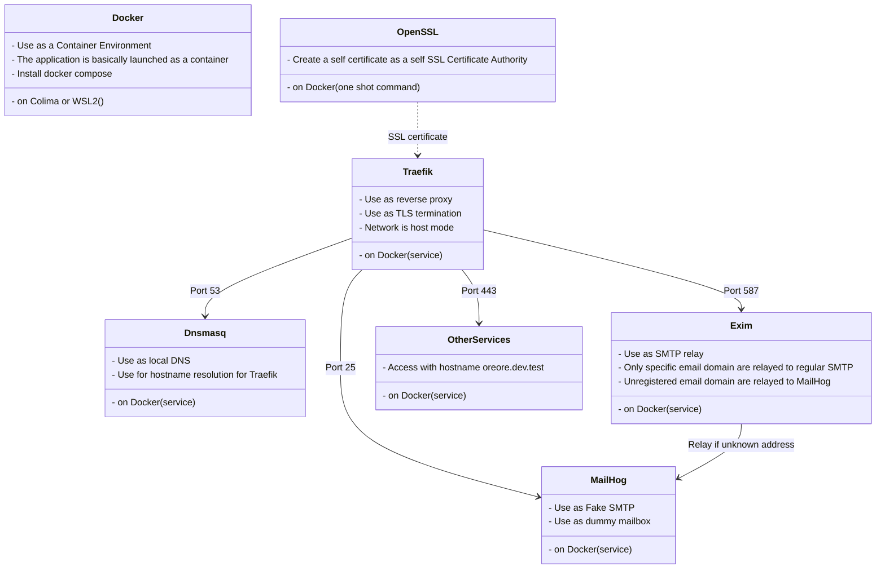

# devbase

Development base environment stack using Docker containers. Using Traefik with TLS, Dnsmasq, Exim4 and MailHog.

I have confirmed that it works with Colima on macOS and WSL2 on Windows 10.
It will probably work on Linux as well.

## Key feutures

- The combination of Traefik and Dnsmasq allows switching the access container by hostname instead of port number.
- You can use MailHog to receive even dummy email addresses.
- By using Exim4, only specific domains can be forwarded to regular SMTP.
- Create a self certification authority and a self certificate with openssl to enable https access.

The software used is as follows:



> **_NOTE:_** Sorry, my native language is Japanese.

## Install

1. clone this repositoy and copy sample.env to .env. (run on WSL2 if Windows)

   ```sh
   git clone https://github.com/arkbig/devbase.git
   cd devbase
   cp sample.env .env
   ```

2. edit .env.

   - <details><summary>🍎 for Mac</summary>

     1. CONTAINER_UID / CONTAINER_GID

        ```sh
        sed -i "" "s/^CONTAINER_UID=.*/CONTAINER_UID=$(id -u)/" .env
        sed -i "" "s/^CONTAINER_GID=.*/CONTAINER_GID=$(id -g)/" .env
        ```

     2. DNSMASQ_ADDR / DNSMASQ_SERVER

        ```sh
        # change to your ethernet.
        use_eth=en0
        sed -i "" "s/^DNSMASQ_ADDR=.*/DNSMASQ_ADDR=`ifconfig "${use_eth}" |grep 'inet '|awk 'END {print $2}'`/" .env
        # bat DNSMASQ_SERVER unuse on Mac.
        sed -i "" -r "s/^#? ?DNSMASQ_SERVER=.*/DNSMASQ_SERVER=`cat /etc/resolv.conf|grep '^nameserver '|awk 'NR==1 {print $2}'`/" .env
        ```

     3. EXIM4_RELAY_DOMAIN / EXIM4_RELAY_ADDR
        This is used to forward mail received by Exim4 to `EXIM4_RELAY_ADDR` if the recipient is `EXIM4_RELAY_DOMAIN`.
        set if you want.
        It is also possible to specify multiple composites with sequential numbers such as \*\_1,\*\_2 in compose.override.yaml.

     4. COMPOSE_PROFILES
        If your environment does not support UDP tunneling (like Colima), enable udptunnel.

     </details>

   - <details><summary>🪟 for Windows(WSL2)</summary>

     1. CONTAINER_UID / CONTAINER_GID

        ```sh
        sed -i "s/^CONTAINER_UID=.*/CONTAINER_UID=$(id -u)/" .env
        sed -i "s/^CONTAINER_GID=.*/CONTAINER_GID=$(id -g)/" .env
        ```

     2. DNSMASQ_ADDR / DNSMASQ_SERVER
        DNSMASQ_ADDR is the fixed IP address to be given to WSL2 after this, but if you do not change it, the default `192.168.100.100` is ok.
        I could not find a good one-liner to rewrite DNSMASQ_SERVER, so I will set it manually.Check the DNS server from the adapter you use in Windows "Network Connections".It is usually the same as the Default Gateway shown by "ipconfig" at the command prompt.

     3. EXIM4_RELAY_DOMAIN / EXIM4_RELAY_ADDR
        This is used to forward mail received by Exim4 to `EXIM4_RELAY_ADDR` if the recipient is `EXIM4_RELAY_DOMAIN`.
        set if you want.
        It is also possible to specify multiple composites with sequential numbers such as \*\_1,\*\_2 in compose.override.yaml.

     </details>

   - <details><summary>🐧 for Ubuntu</summary>

     1. CONTAINER_UID / CONTAINER_GID

        ```sh
        sed -i "s/^CONTAINER_UID=.*/CONTAINER_UID=$(id -u)/" .env
        sed -i "s/^CONTAINER_GID=.*/CONTAINER_GID=$(id -g)/" .env
        ```

     2. DNSMASQ_ADDR / DNSMASQ_SERVER

        ```sh
        # change to your ethernet.
        use_eth=eth0
        sed -i "s/^DNSMASQ_ADDR=.*/DNSMASQ_ADDR=`ip a show ${use_eth}|grep 'inet '|awk 'END {print $2}'|awk -F '/' '{print $1}'`/" .env
        # or set manually.
        sed -i "" -r "s/^#? ?DNSMASQ_SERVER=.*/DNSMASQ_SERVER=`cat /etc/resolv.conf|grep '^nameserver '|awk 'END {print $2}'`/" .env
        ```

     3. EXIM4_RELAY_DOMAIN / EXIM4_RELAY_ADDR
        This is used to forward mail received by Exim4 to `EXIM4_RELAY_ADDR` if the recipient is `EXIM4_RELAY_DOMAIN`.
        set if you want.
        It is also possible to specify multiple composites with sequential numbers such as \*\_1,\*\_2 in compose.override.yaml.

     </details>

3. create certificates.

   ```sh
   mkdir sslcert/.certs
   docker compose build sslcert
   docker compose run --rm sslcert
   ```

4. register sslcert/.certs/ca-My-Test.cer to the OS

   - <details><summary>🍎 for Mac</summary>

     - To Keychain Access. (Open the .cer file in the finder.)

     </details>

   - <details><summary>🪟 for Windows(WSL2)</summary>

     - To MMC. (Open the .cer file in the explorer.)
       - Certificate store is "Trusted Root Certification Authorities".
     - Also installed in WSL2 (see Ubuntu)

     </details>

   - <details><summary>🐧 for Ubuntu</summary>

     - copy & add

       ```sh
       sudo mkdir /usr/share/ca-certificates/self
       sudo cp ./sslcert/.certs/ca-My-Test.cer /usr/share/ca-certificates/self/
       sudo echo "self/ca-My-Test.cer" >> /etc/ca-certificates.conf
       sudo update-ca-certificates
       ```

     </details>

5. run compose.

   ```sh
   docker compose up -d
   ```

   - Although an image is specified, it does not exist, so a pull will result in an error and build will run.

6. DNS related settings

   - <details><summary>🍎 for Mac</summary>

     - ❓ Check command is `sudo lsof -i:53`. If TCP is present but UDP is not, as shown below, this is not supported UDP port forwarding.

       ```sh
       COMMAND   PID USER   FD   TYPE             DEVICE SIZE/OFF NODE NAME
       ssh       732  big   41u  IPv4 0xbeaf      0t0  TCP *:domain (LISTEN)
       🆖 UDP is missing. So run udptunnel.
       ```

     - Run udptunnel using socat. If UDP was supported, skip this next is add to resolver.

       - for host

         ```sh
         sudo brew install socat
         udptunnel/forward_udp.sh udptunnel/udp_forwarding.conf &
         # If you want to stop, run the following command
         # udptunnel/forward_udp.sh udptunnel/udp_forwarding.conf kill
         ```

       - for container

         ```sh
         COMPOSE_PROFILES=udptunnel docker compose up -d --build
         ```

         Also, you can add `COMPOSE_PROFILES=udptunnel` to `.env`

     - Add to resolver for dnsmasq

       ```sh
       sudo mkdir /etc/resolver
       # "test" is the domain name to be used.
       vi /etc/resolver/test
       ```

       - `/etc/resolver/test` contents.

         ```ini
         options timeout:1
         options attempts:2
         options use-vc
         nameserver 127.0.0.1
         ```

     </details>

   - <details><summary>🪟 for Windows(WSL2)</summary>

     1. set and run wsl2/wsl_startup.bat as administrator on host Windows.
        If necessary, copy wsl_env.bat to .wsl_env.bat to set variables.
        wsl_startup.bat does the following by default:

        - set static ip address to WSL. (IMPORTANT here)
        - start dockerd
        - start sshd
        - port forwarding for ssh

        register wsl_startup_helper.bat in task scheduler to run as administrator at startup.
        copy these like `cp wsl2/wsl_startup_helper.bat to /mnt/c/Users/$USER/` first.
        and wsl_startup_helper.bat's arg is path to wsl_startup.bat like "\\\\wsl$\\Ubuntu-20.04\\Home\\user\\devbase\\wsl2\wsl_startup.bat"

     2. ❓ check command is `ping 192.168.100.100`.(This is the DNSMASQ_ADDR.) both Win and WSL.
     3. Change adapter settings.
        Set "Use the following DNS server addresses:"

        - Preferred DNS server: 192.168.100.100 (This is the DNSMASQ_ADDR.)
        - Alternate DNS server: 1.1.1.1 (This is your real DNS.)

     4. For WSL2(in WSL2)

        create `/etc/wsl.conf` (sudo vi /etc/wsl.conf)

        ```ini
        [network]
        generateResolvConf = false
        ```

        ```sh
        sudo cp /etc/resolv.conf /etc/resolv.conf.bak
        sudo rm /etc/resolv.conf
        sudo mv /etc/resolv.conf.bak /etc/resolv.conf
        vi /etc/resolv.conf
        ```

        ```ini
        options timeout:1
        options attempts:2
        nameserver 127.0.0.1
        # This is your real DNS ($DNSMASQ_SERVER in .env)
        nameserver 1.1.1.1
        ```

     </details>

   - <details><summary>🐧 for Ubuntu</summary>

     - Add to /etc/resolv.conf

       ```ini
       options timeout:1
       options attempts:2
       nameserver 127.0.0.1
       # This is your real DNS ($DNSMASQ_SERVER in .env)
       nameserver 1.1.1.1
       ```

     </details>

7. ❓ check.
   - Access <https://traefik.dev.test>
   - If you see the Traefik dashboard, success!🎉

## Customize

### Popular settings

`compose.override.yaml`にDNSMASQ_ADDRを設定します。
IPアドレスの部分は自分のマシンのものに置き換えてください。
127.0.0.1だとコンテナから\*.dev.testにアクセスした場合、コンテナ内を指すことになります。
このようにホストのIPアドレスを指定すれば、コンテナからもホストマシンへアクセスできるようになります。

```yaml
services:
  dnsmasq:
    environment:
      DNSMASQ_ADDR: 10.0.0.1
```

### Self CA / Self signed certificates

compose.override.yamlのsslcertサービスにenvironmentsを指定すると変更できます。
下記がデフォルト値での設定例です。

```yaml
sslcert:
  environment:
    # 作成される証明書たちのownerを指定
    CONTAINER_UID: 501
    CONTAINER_GID: 20
    # 出力先フォルダ(コンテナ内パス)
    CERTS_OUT: /certs
    # 自己認証局の設定
    ## 名称
    CA_CN: My Test
    ## 生成するファイルのbasename
    CA_FILEBODY: <normalized CA_CN>
    ## OSに登録する認証局の証明書ファイル名
    CA_CERT: $CA_FILEBODY.cer
    ## 証明書発行時に使用する証明書の秘密鍵
    CA_KEY: $CA_FILEBODY.key
    ## 秘密鍵の保存時の暗号パスワード（空文字なら平文保存）
    CA_PASS: $CA_FILEBODY.pass
    ## 認証局の属性
    ## /C=国コード/ST=県/O=組織名/OU=部門などが指定できる
    ## /CN=が未指定なら自動で/CN=$CA_CNが付与される
    CA_SUBJ: /CN=$CA_CN
    # 自己証明書の設定
    ## 名称（古いシステム用のドメイン）
    SSL_CN: dev.test
    ## 新しいシステム用のSANなど
    SSL_ADDEXT: subjectAltName=DNS:test,DNS,dev.test,DNS:*.dev.test,DNS:localhost,DNS:dev.localhost,DNS:*.dev.localhost,IP:127.0.0.1
    ## 生成するファイルのbasename
    SSL_FILEBODY: <normalized SSL_CN>
    ## サーバーに設定する自己証明書（公開鍵）
    SSL_CERT: $SSL_FILEBODY.cer
    ## サーバーに設定する自己証明書の秘密鍵
    SSL_KEY: $SSL_FILEBODY.key
    ## 認証局への署名リクエストファイル（手抜きなので本番には使えない）
    SSL_CSR: $SSL_FILEBODY.csr
    ## 自己証明書の保存時の暗号パスワード（空文字なら平文保存）
    SSL_PASS: ""
    ## 自己証明書のシリアル番号保存ファイル
    SSL_SERIAL: $SSL_FILEBODY.srl
    ## 自己証明書の属性
    ## /C=国コード/ST=県/O=組織名/OU=部門などが指定できる
    ## /CN=が未指定なら自動で/CN=$SSL_CNが付与される
    SSL_SUBL: /CN=$SSL_CN
```

### Dnsmasq

compose.override.yamlのdnsmasqサービスにenvironmentを指定すると変更できます。
下記がデフォルト値での設定例です。

通常は`DNSMASQ_ADDR`を指定します。
固定IPならホストマシンのIPアドレス、そうでなければループバックインターフェイスを作成してそれを指定することになるでしょう。

DNSMASQ*DOMAINに指定した値によって、OSのresolverに登録するドメインも変わります。
DNSMASQ*{DOMAIN,ADDR}\_1とか追加で指定したときも、OSのresolverに追加登録が必要です。

```yaml
dnsmasq:
  environment:
    # Dnsmasqの起動引数
    # この他に -A "/$DNSMASQ_DOMAIN/DNSMASK_ADDR -A ...が付与される
    DNSMASQ_ARGS: -h -k -n -R -u root -8 -
    # メインの変換ドメイン
    DNSMASQ_DOMAIN: .test
    # メインの変換IPアドレス(コンテナから使用するため、ホストIPアドレスにすべき)
    DNSMASQ_ADDR: 192.168.100.100
    # 以降も連番で指定可能
    # 空文字れつもしくは未定義に遭遇するとそこで終了
    # "-"ハイフンだけならその番号はスキップして、次の番号を処理
    DNSMASQ_DOMAIN_1:
    DNSMASQ_ADDR_1:
    # 通常使うDNSサーバー
    DNSMASQ_SERVER: 1.1.1.1
    # 以降も連番で指定可能
    # 空文字れつもしくは未定義に遭遇するとそこで終了
    # "-"ハイフンだけならその番号はスキップして、次の番号を処理
    DNSMASQ_SERVER_1:
```

## udptunnel

compose.override.yamlのudptunnelサービスにenvironmentを指定すると変更できます。
下記がデフォルト値での設定例です。

```yaml
udptunnel:
  environment:
    # コンテナ内でコマンド実行するownerを指定
    CONTAINER_UID: 501
    CONTAINER_GID: 20
```

また、udp_forwarding.confを変更すると別のポート番号もトンネルできます。

## MailHog

特になし。[公式のコンテナ](https://hub.docker.com/r/mailhog/mailhog/)を使っています。

## Exim4

compose.override.yamlのexim4サービスにenvironmentを指定すると変更できます。
下記がデフォルト値での設定例です。

社内用なら`EXIM4_RELAY_DOMAIN`に自社のドメイン名、`EXIM4_RELAY_ADDR`に自社のSMTPサーバーをそれぞれ指定することになるでしょう。
これで、宛先を間違えて社外に情報が流出するのを防げます。

```yaml
exim4:
  environment:
    # 通常のメール転送先(ポート番号指定する場合"::"コロンが２つなので注意)
    EXIM4_SMARTHOST: mailhog::1025
    # 宛先ドメインが指定したものだったら、専用の転送先に送る
    EXIM4_RELAY_DOMAIN:
    # 専用の転送先(これもポート番号指定する場合"::"コロンが２つなので注意)
    EXIM4_RELAY_ADDR:
    # 追加の変更ドメイン
    EXIM4_RELAY_DOMAIN_1:
    # 追加の変更IPアドレス
    EXIM4_RELAY_ADDR_1:
    # 以降も連番で指定可能
    # 空文字れつもしくは未定義に遭遇するとそこで終了
    # "-"ハイフンだけならその番号はスキップして、次の番号を処理
```

## License

This repository's license is [MIT](./LICENSE).

Also using the following OSS:

| Software                                              | License                 |
| ----------------------------------------------------- | ----------------------- |
| [Dnsmasq](https://thekelleys.org.uk/dnsmasq/doc.html) | License: GPL, version 3 |
| [Exim](https://www.exim.org)                          | License: GPL, version 3 |
| [MailHog](https://github.com/mailhog/MailHog)         | License: MIT            |
| [OpenSSL](https://www.openssl.org)                    | License: OpenSSL        |
| [Socat](http://www.dest-unreach.org/socat/)           | License: GPL, version 2 |
| [Traefik](https://github.com/traefik/traefik)         | License: MIT            |
